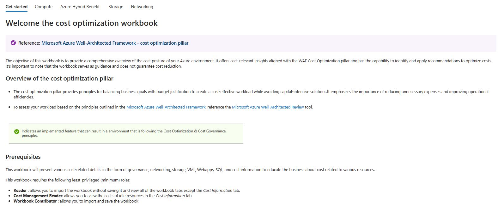

# 🧰 Cost-Optimization-Factory

## Welcome to the **cost optimization workbook**. 
The objective of this workbook is to provide a comprehensive overview of the cost posture of your Azure environment. It offers cost-relevant insights aligned with the WAF Cost Optimization pillar and has the capability to identify and apply recommendations to optimize costs.

This workbook has the following tabs [Get Started](/workbook/modules/GetStarted), [Compute](/workbook/modules/Compute), [Azure Hybrid Benefit](/workbook/modules/AHUB), [Storage](/workbook/modules/Storage), [Networking](/workbook/modules/Networking).

<figure>
    
</figure>

## 👩‍💻 Contributing

There are many ways to participate. From reporting bugs and requesting features or even making code changes. See the [contribution guide ➡️](./contributing.md)

## Change Log

Stay up to date with the workbook latest changes and improvements:

### Change Log

|Version|Date|Description|
|---|---|---|
|v1.1.1| 20/09/2021 | Initial Release
|v1.1.2| 25/09/2021 | Sort resource groups and tags filter alphabetically
|v1.1.3| 03/10/2021 |-Added export button to applicable queries -Remove developer and express from SQL VMs query -Fixed typo in overview tab notes -Linux AHUB-filter RedHat and Suse only -Added changelog
|v1.1.4| 20/10/2021 | -Fixed bug in performance tab NIC drop down  -Added subscription filter to performance tab -Added TimeRange parameter -Added search filter field for the Resources tagged tile in the ResourceDetails group under Performance tab -Fixed issue in VMs performance query Simplified WebApps and AKS queries to avoid throttling
|v1.1.5| 01/11/2021 | -Fixed Tag filter parameters to avoid empty tags in queries   -Fixed tag queries for performance and better results   -Fixed empty queries messages  -Change style of guidance messages -Fixed bug for unattached IPs reporting with NAT gateways|
|v1.1.6| 24/11/2021 | -Show only application gateways with empty backendpools|
|v1.1.7| 27/01/2022 | -Fixed bug for unattached IPs reporting with NAT gateways with Tag Filters   -Added check for idle NICs with attached Public IPs|
|v1.1.8| 16/02/2022 | -Added untagged resources list   -Added storage account tiers   -Added a link to storage account insights for each legacy storage account   -Added AHUB check for windows VMSS   -Fixed unattached disk query   -Fixed App service query (not showing all apps in a service plan)   -Added "Cost Information" tab|
|v1.1.9| 14/06/2022 | - Fixed "unattached disk" query in the cost information tab |
|v1.2.0| 24/07/2022 | - Removed FileStorage account type from V2 query   - Added new column in "Cost Information" tab to show total VM cost with AHUB   - Changed VPN metrics aggregation   - Changed column some names |
|v1.2.1| 08/11/2022 | - Add Front Door metrics   - Changed cost information billing for VMs without AHUB to TheLastBillingMonth   - Increased row limit to in compute queries    - Updated AKS query to show Spot VMs    - Fixed Linux AHUB query to show RHEL license   - Add subscriptions advisor recommendations |
|v1.2.2| December/2022 | - Minor fix to the Storage Advisor query |
|v1.3.0 | March /2023 | - Fixed Cost Information Tab |
|v2.0.0 | March /2023 | - Added Azure Hybrid Benefit tab|
|v2.1.0 |July /2023 | - Major improvement on filters -Added quick fix buttons |

**Workbook v 2.1.0 has been integrated with Azure Advisor**

